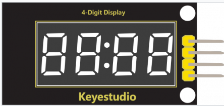
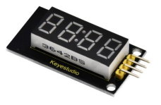
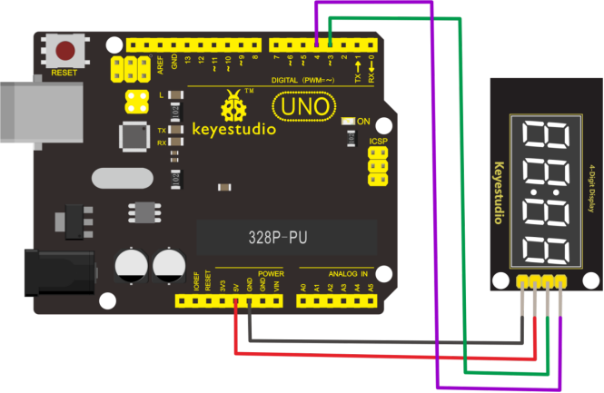
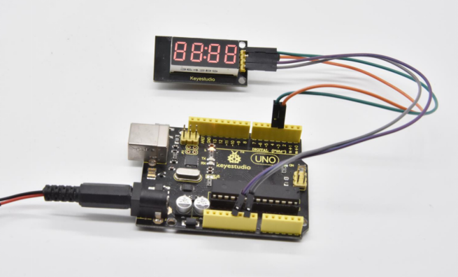

# KS0445 keyestudio 4-digit LED Display Module



## 1. Overview

The keyestudio 4-digit LED Display Module integrates a 0.36" 4-Digit 7-Segment Display Common Anode with 12 pins. It uses the driver chip TM1637.

The module has 4 control pins of 2.54mm pitch, which can direct connect to microcontroller with jumper wires. So it’s very easy to control the matrix without tons of wiring. Available to make microcontroller control the 4-digit LED segment display via signal interface, greatly saving IO pin resource on microcontroller.

The module has two 3mm fixed holes, convenient for mounting on other devices. If you've been eyeing matrix displays but hesitated because of the complexity, this is the solution you've been looking for!

## 2. Technical Details



- Operating voltage: DC 5V
- Operating temperature range: 0～+50℃
- Dimensions: 45mm * 21mm * 10mm
- Weight: 7.2g

## 3. Hookup Guide

Connect the CLK pin to Digital 4, DIO pin to Digital 3, VCC pin to 5V, GNG to ground.



## 4. Test Code

Download Resource  :  [Resource](./Resource.7z)

Note： before uploading the code, you need to import the library files; otherwise, the code upload will fail.

```c
#include "TM1637.h"
#define CLK 4//pins definitions for TM1637 and can be changed to other ports       
#define DIO 3
TM1637 tm1637(CLK,DIO);

void setup()
{
  tm1637.init();
  tm1637.set(BRIGHT_TYPICAL);//BRIGHT_TYPICAL = 2,BRIGHT_DARKEST = 0,BRIGHTEST = 7;
}

void loop()
{
  //int8_t NumTab[] = {0,1,2,3,4,5,6,7,8,9,10,11,12,13,14,15};//0~9,A,b,C,d,E,F
  int8_t NumTab[] = {0,1,2,3,4,5,6,7,8,9};//0~9,A,b,C,d,E,F
  int8_t ListDisp[4];
  unsigned char i = 0;
  unsigned char count = 0;
  delay(150);
  while(1)
  {
    i = count;
    count ++;
    if(count == sizeof(NumTab)) count = 0;
    for(unsigned char BitSelect = 0;BitSelect < 4;BitSelect ++)
    {
      ListDisp[BitSelect] = NumTab[i];
      i ++;
      if(i == sizeof(NumTab)) i = 0;
    
    tm1637.display(0,ListDisp[0]);
    tm1637.display(1,ListDisp[0]); 
    tm1637.display(2,ListDisp[0]);
    tm1637.display(3,ListDisp[0]);
    tm1637.point(POINT_ON);
    delay(100);
    }
  }
}
```

## 5. Result

Done uploading the code, the 4-digit LED display will show the number from 0 to 9. The LED segment display is normally on and each segment shows the same digit.

